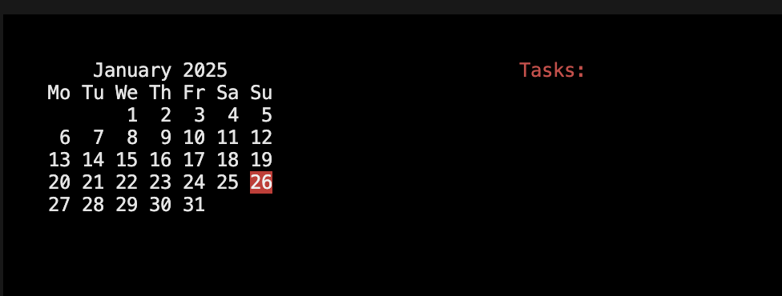
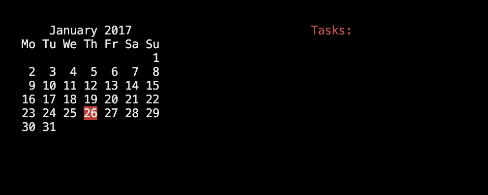
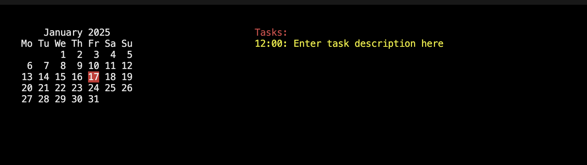

# CLI Calender
This is a fun project I am doing to learn a bit about the curses library, play around with sqlite3 and see how hard it is to actually make something. When running any of the commands an curses window is opened and can be exited with either `CTRL + C` or `CTRL + Z`. Moving around in the calender is done with the standard ARROW UP, DOWN, LEFT and RIGHT keys. Moving to an new date the saved tasks for that date  will be displayed on the right side of the window.

## Warning!
This is very much an work in progress so things might break!

## Instaling
Clone this repo, make an venv and install the latest setuptools with pip.
Then run `pip install -e .` in the root dir of the project and cli_calender will be installed in the venv.

## Examples
To view the current month just use `cli_calender` and an new terminal window will open with the current month.
On the left side is the current month and on the right side are the tasks scheduled for that day.
The flags --year, --month and --day together or one at at time can be used to specify the desired date on which the calender view will open.
The default values for each are taken from the current date. Note that the date is currently just taken from the OS-es date.

`cli_calender`

`cli_calender --year 2017`

For more info use the -h or --help flag.

## Task
The callender sets tasks that are displayed on the right side via the task subcomand.
Tasks are saved in a sqlite3 db table called - you guessed it ~~appointments~~ tasks!
The task subcommand has two commands add and delete that both accept an required flag --date in the format `YYYY-mm-DD HH:MM`.
To add an task to use the following syntax `cli_calender task add --date "2025-01-17 12:00" "Enter task description here"`.

To delete an task from the calende simply change add to delete and remove the description
`cli_calender task delete --date "2025-01-17 12:00"`

## TODO
1. Allow changing of the default date.
2. Tests! Lots of tests...